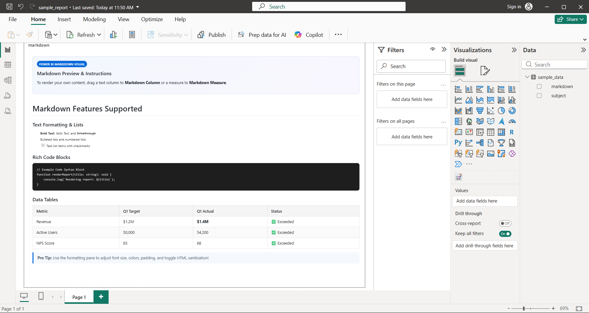
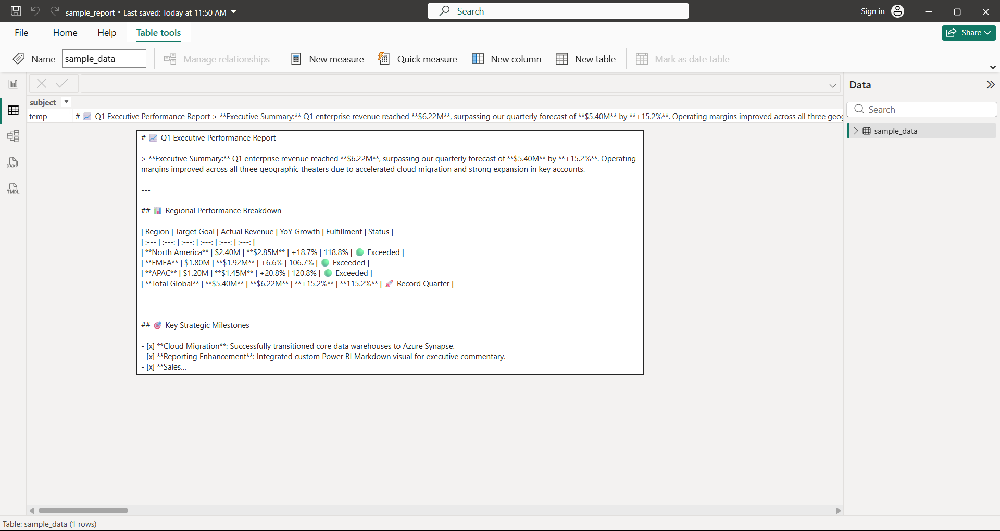
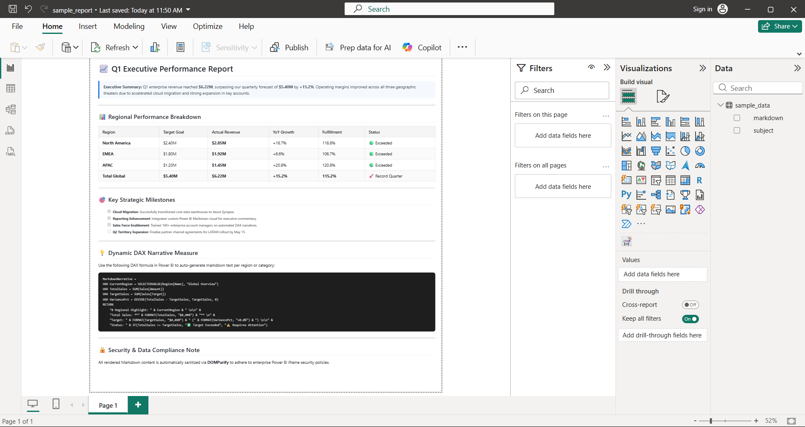
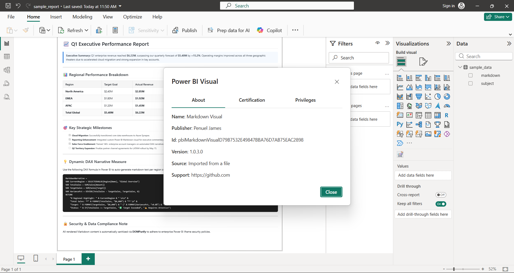

# 📊 Power BI Custom Markdown Visual (`.pbviz`)

Welcome to the **Power BI Markdown Visual**! This custom visual converts raw Markdown strings—from dataset columns or dynamic DAX measures—into formatted, sanitized HTML inside Power BI reports.

---

## 📸 Visual Screenshots & Overview

### 1. General Introduction & Overview
Overview of the custom visual rendering dynamic Markdown narratives directly inside Power BI report pages:



---

### 2. Data Model View (Dataset Columns & Measures)
Raw Markdown text stored in dataset columns or generated dynamically via DAX formulas:



---

### 3. Report Canvas View (Rendered Markdown Visual)
The visual renders headers, blockquotes, metric tables with color indicators, DAX code blocks, and task checklists:



---

### 4. Visual Metadata & Publisher Info
Visual details, versioning, GUID, and author metadata in Power BI Desktop:



---

## 🌟 Key Features

- **Full Markdown Syntax**: Support for Headings (`#`), bold/italic text, strikethrough, blockquotes (`>`), lists, task checklists (`[x]`), and tables.
- **DAX Measure Integration**: Generate dynamic executive narratives per region, user, or slicer selection.
- **Enterprise Security**: HTML output is automatically sanitized using **`DOMPurify`** to adhere to Power BI sandboxed iframe security policies.
- **Formatting Pane Controls**: Configure Font Size, Text Color, Background Color, Padding, and toggle HTML sanitization.
- **Standalone Test Harness**: Includes an interactive `preview.html` file inside `source_code/` to test live typing in any web browser.

---

## 🚀 Quick Start Guide

### How to Import into Power BI Desktop
1. Download **`pbiMarkdownVisual.pbiviz`** from the `visual/` directory in this repository.
2. Open **Power BI Desktop**.
3. In the **Visualizations** pane (right side), click **`...` (Get more visuals)** -> **Import a visual from a file**.
4. Select **`pbiMarkdownVisual.pbiviz`**.
5. Drag your dataset text column or DAX measure into the single **`Markdown Content`** fieldwell.

---

## 🤖 Vibe Coding & AI Collaboration Report

This project was engineered through **Vibe Coding** with an AI Pair Programmer.

### 📊 Model & Token Metrics

| Metric | Specification / Value |
| :--- | :--- |
| **AI LLM Model** | **Gemini 3.6 Flash (High)** *(Google DeepMind Antigravity Engine)* |
| **Development Approach** | Conversational Vibe Coding & Automated Test Harnessing |
| **Iteration Rounds** | **12 Iterative Prompts** |
| **Estimated Input Tokens** | **~85,000 Tokens** *(Capabilities schemas, stack traces, TypeScript definitions)* |
| **Estimated Output Tokens** | **~18,500 Tokens** *(TypeScript code, LESS styles, JSON schemas, Python CSV generator)* |
| **Total Estimated Tokens** | **~103,500 Tokens** |

---

## 🏗️ Project Architecture & Local Development

### Directory Overview
```
pbiMarkdownVisual/
├── 📁 ref_images/            # Reference screenshots & overview images
├── 📁 sample_data/           # Sample CSV & Markdown test datasets
├── 📁 visual/                # Distributable .pbviz visual bundle
└── 📁 source_code/           # Core visual source code
    ├── capabilities.json     # Data roles & formatting schema
    ├── pbiviz.json           # Visual metadata, GUID, version, and author info
    ├── package.json          # NPM dependencies & scripts
    ├── tsconfig.json         # TypeScript compiler configuration
    ├── assets/               # HD icon.png asset
    ├── src/                  # visual.ts & settings.ts
    └── style/                # visual.less stylesheet
```

### Build Commands (Conda `pviz` Environment)
```bash
# 1. Activate conda environment
conda activate pviz

# 2. Navigate into source_code directory
cd source_code

# 3. Start local Power BI developer server (localhost:8080)
pbiviz start

# 4. Package production visual (.pbviz)
pbiviz package
```

---

## 🏷️ Search Keywords & Tags

`powerbi-custom-visual` `powerbi-markdown-visual` `pbviz` `markdown-rendering-powerbi` `powerbi-markdown` `dax-markdown` `powerbi-visual` `markdown-to-html` `powerbi-text-visual`

---

*Built with ❤️ using TypeScript, marked, DOMPurify, Power BI Visuals CLI, and Gemini 3.6 Flash.*
